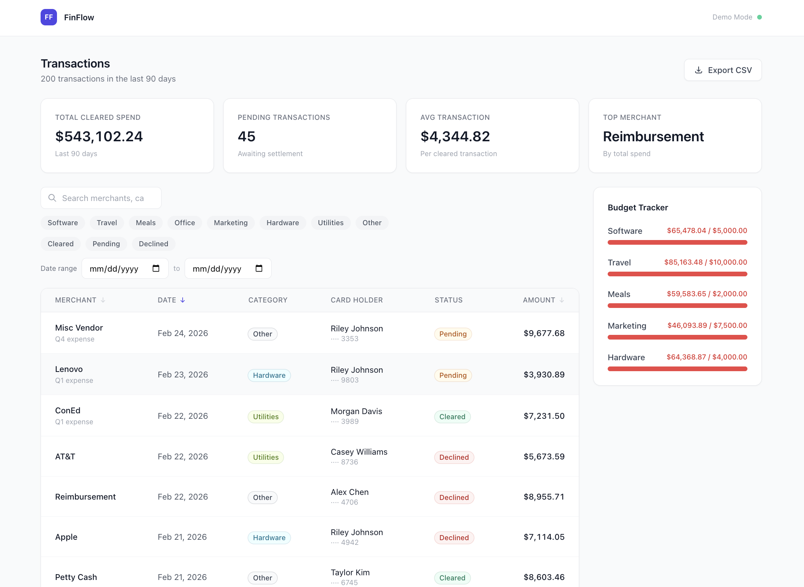

# FinFlow

A financial expense management dashboard built to demonstrate production-quality React and TypeScript architecture in Ramp's core product domain.

**Live demo → https://finflow-navy.vercel.app**



---

## Overview

FinFlow simulates the kind of expense intelligence interface finance teams use daily. It handles 200 transactions across a 90-day period with real-time filtering, sorting, pagination, budget tracking, spending trends visualization, and data export — built with the same architectural principles used in production fintech systems.

---

## Features

- **Transaction table** — sort by merchant, date, or amount with instant visual feedback
- **Multi-layer filtering** — filter by category, status, date range, and keyword simultaneously
- **Summary cards** — total cleared spend, pending count, average transaction, and top merchant by volume
- **Weekly spend chart** — SVG bar chart showing spend trends across the full 90-day period with hover tooltips
- **Budget tracker** — per-category spend vs. limit with color-coded progress bars (green → amber → red)
- **Transaction detail modal** — click any row for full transaction details, dismiss with Escape or backdrop click
- **⌘K Command palette** — keyboard-driven command interface for filters, sorting, and export
- **CSV export** — exports the current filtered result set, not just the visible page
- **Persistent filters** — filter and sort preferences survive page refresh via localStorage
- **Keyboard shortcuts** — press `/` to focus search, `⌘K` to open command palette
- **Skeleton loading states** — layout-preserving placeholders during data fetches
- **Error handling** — graceful error banner with full recovery path

---

## Architecture

The core of this project isn't the features — it's the decisions underneath them.

### Money stored in cents

All amounts are integers. `$12.50` is stored as `1250`. Floating point arithmetic is unreliable for financial data (`0.1 + 0.2 === 0.30000000000000004`). Converting to a display string happens only at render time, in one place.

### Discriminated union for async state

Instead of separate `isLoading` and `error` booleans, all async state uses a discriminated union:
```typescript
type AsyncState<T> =
  | { status: 'idle' }
  | { status: 'loading' }
  | { status: 'success'; data: T }
  | { status: 'error'; error: string }
```

This makes invalid states unrepresentable. You cannot have `loading: true` and `data: exists` simultaneously. TypeScript enforces it at compile time.

### Mock API layer with a real contract

`src/mock/handlers.ts` exposes `fetchTransactions` with an interface identical to what a real backend would provide. Components never know the difference. Swapping in a production API requires changing one file — zero UI changes.

### useEffect cleanup for race conditions

When filters change before a fetch completes, a stale response could overwrite fresher data. A `cancelled` flag in the `useEffect` cleanup prevents this entirely.
```typescript
useEffect(() => {
  let cancelled = false;
  fetchTransactions(params).then(data => {
    if (!cancelled) setState({ status: 'success', data });
  });
  return () => { cancelled = true; };
}, [filters, sort, page]);
```

### localStorage persistence

Filter and sort preferences persist across sessions. `useFilters` and `useSort` both read from and write to localStorage with graceful fallback to defaults on parse errors.

### Custom hooks own all stateful logic

Components render. Hooks think. `useTransactions`, `useFilters`, `useSort`, and `usePagination` each own exactly one concern. This makes each piece independently testable and keeps components focused on their single responsibility.

---

## Tech Stack

| | |
|---|---|
| Framework | React 18 |
| Language | TypeScript (strict mode) |
| Build tool | Vite |
| Styling | Tailwind CSS |
| Deployment | Vercel |

---

## Project Structure
```
src/
├── components/
│   ├── budget/        # BudgetPanel, BudgetBar
│   ├── common/        # Card, Badge, Modal, CommandPalette, LoadingSkeleton, ErrorBanner
│   ├── filters/       # SearchInput, CategoryFilter, StatusFilter, DateRangeFilter
│   ├── summary/       # SummaryCards, SummaryCard, SpendingTrends
│   └── table/         # TransactionTable, TransactionRow, TableHeader, Pagination, TransactionDetail
├── hooks/             # useTransactions, useFilters, useSort, usePagination
├── mock/              # data.ts (seeded generator), handlers.ts (mock API)
├── types/             # index.ts — single source of truth for all domain types
└── utils/             # currency.ts, date.ts, sorting.ts, csv.ts
```

---

## Running Locally
```bash
npm install
npm run dev
```

Open `http://localhost:5173`

---

## What I'd add next

- URL-synchronized filter state so filtered views are shareable and bookmarkable
- Virtualized list rendering for 10,000+ row performance (`@tanstack/virtual`)
- Optimistic updates on transaction edits with rollback on failure
- Plaid sandbox integration for real bank transaction data
- Full accessibility audit — axe DevTools, keyboard navigation pass
